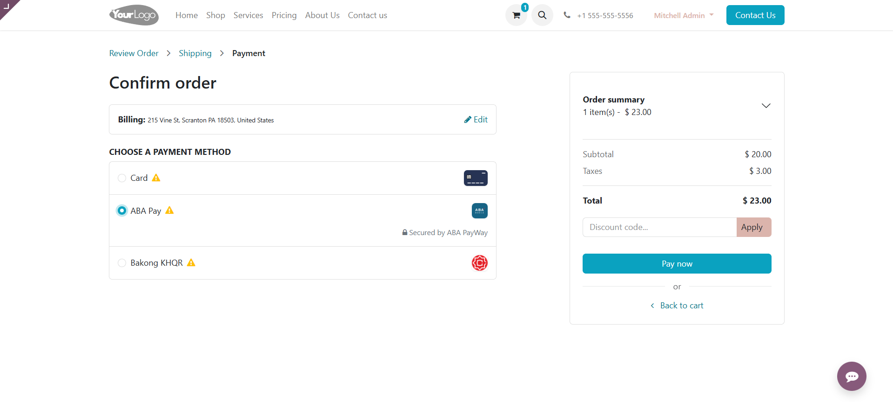
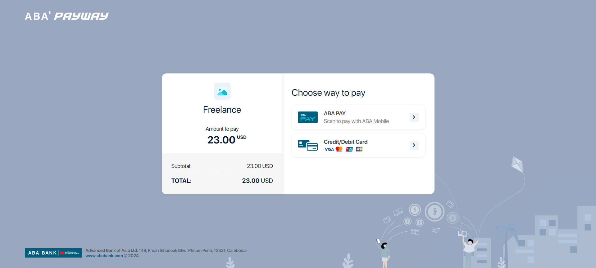
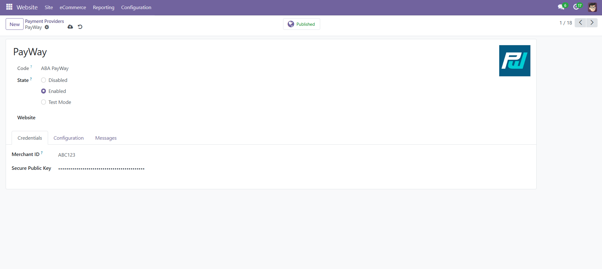
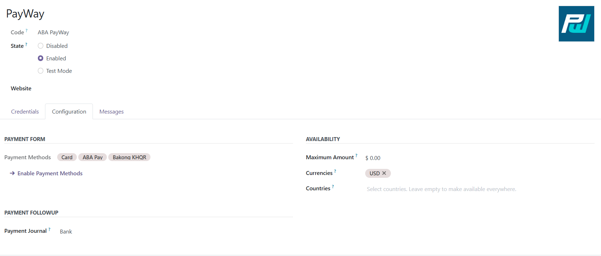

# PayWay

## Technical details

API: [PayWay Payment Gateway](https://www.payway.com.kh/developers/)

This module integrates ABA PayWay using the generic payment with redirection flow based on form
submission provided by the `payment` module.

## Supported features

- Payment with redirection flow
- PayWay webhook status notification
- Verify transaction status from ABA against Webhook data
- Support Cards, ABA Pay, Bakong KHQR

## Odoo Website Payment (Test Mode)

## Odoo PayWay Payment Provider & Methods

## Setup process 
- Create a folder called `payment_payway` in the Addons folder 
- Clone this repository into the folder 
- Go to your Odoo dashboard and turn on **developer mode** 
- Go to Apps > Update Apps List
- You can now search for the module and install it

## Module history

- `1.0`
  - Payment with redirection flow
  - PayWay Webhook integration 
  - Support Cards, ABA Pay, Bakong KHQR

## Future plans 

- `1.1`
  - Require suggestions from the community

## Testing instructions

**Card Type**: `Master Card`

**Card Number**: `5156 8399 3770 6226`

**EXP Date**: `01/2030`

**CVV2**: `923`

**3D Enrolled**: `No`